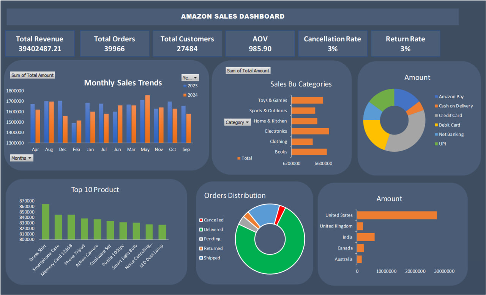

# 🛒 Amazon Sales Analysis Dashboard — 2023 & 2024

> 📊 **Excel Data Analytics Project** | Sales Performance | Business Insights | Interactive Dashboard

## 📌 Project Overview

This project analyzes **Amazon sales data for 2023 and 2024** using Microsoft Excel to understand sales performance, customer behavior, product performance, and overall business trends.

The project includes **data cleaning, data analysis, KPI calculation, Pivot Tables, Pivot Charts, and an interactive Excel dashboard**.

---

## 🎯 Business Objectives

The main objective of this project is to answer important business questions such as:

* How much total revenue was generated?
* How many orders and customers were recorded?
* What is the Average Order Value?
* How are sales changing month by month?
* Which categories generate the highest sales?
* What is the cancellation rate?
* What is the return rate?
* Which products and regions perform best?

---

## 📊 Key KPIs

| KPI                    | Description                          |
| ---------------------- | ------------------------------------ |
| 💰 Total Revenue       | Overall revenue generated            |
| 🛍️ Total Orders       | Total number of orders               |
| 👥 Total Customers     | Total customers                      |
| 📦 Average Order Value | Average revenue per order            |
| ❌ Cancellation Rate    | Percentage of cancelled orders       |
| 🔄 Return Rate         | Percentage of returned orders        |
| 📈 Monthly Sales Trend | Sales performance by month           |
| 🏷️ Sales by Category  | Revenue comparison across categories |
| 🌎 Sales by Region     | Regional sales performance           |

---

## 🛠️ Tools & Techniques

### Microsoft Excel

* Data Cleaning
* Data Transformation
* Excel Formulas
* Pivot Tables
* Pivot Charts
* Slicers
* Conditional Formatting
* KPI Cards
* Dashboard Design
* Sales Trend Analysis
* Category & Regional Analysis

---

## 📈 Dashboard Preview



---

## 🔍 Analysis Performed

### 📅 Time Analysis

* Monthly sales trends
* Year-wise sales comparison
* Identification of high and low-performing periods

### 🏷️ Category Analysis

* Category-wise revenue
* Category performance comparison
* Identification of top-performing categories

### 🌎 Regional Analysis

* Sales by region
* Regional performance comparison

### 🛍️ Order Analysis

* Total orders
* Cancelled orders
* Returned orders
* Cancellation rate
* Return rate

### 👥 Customer Analysis

* Total customers
* Customer-level sales analysis
* Average Order Value

---

## 💡 Key Insights

The dashboard helps identify:

* Overall sales performance
* Monthly sales patterns
* High-performing product categories
* Regional sales performance
* Customer and order trends
* Cancellation and return behavior

---

## 📂 Project Structure

```text
amazon-sales-analysis/
│
├── README.md
│
├── Data/
│   └── Amazon_Sales_2023_2024.xlsx
│
├── Dashboard/
│   └── Amazon_Sales_Dashboard.xlsx
│
├── Screenshots/
│   └── Amazon_Sales_Dashboard.png
│
└── Documentation/
    └── Project_Overview.pdf
```

---

## 🚀 How to Use

1. Download the Excel dashboard from the `Dashboard` folder.
2. Open the file using Microsoft Excel.
3. Use the available **Slicers and Filters** to explore the data.
4. Review the KPI cards, charts, and sales trends.
5. Explore the underlying Pivot Tables for detailed analysis.

---

## 📌 Project Highlights

✨ Excel-based end-to-end sales analysis
✨ Interactive dashboard
✨ KPI-driven business analysis
✨ Monthly and category-wise analysis
✨ Cancellation & return analysis
✨ Data visualization using Excel

---

## 👨‍💻 Author

**Md Jishan Ahmad**

Aspiring Data Analyst | Excel | SQL | Python | Power BI

---

⭐ **If you find this project useful, feel free to explore the repository and connect with me.**
